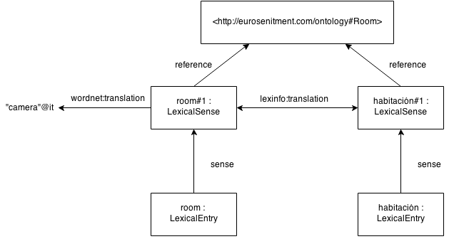

% Publishing and Linking WordNet using _lemon_ and RDF
% ♣John McCrae, ♦Christian Fellbaum, ♣Philipp Cimiano
% ♣Semantic Computing Group, University of Bielefeld. ♦Princeton University

# What is WordNet?

* WordNet is one of the oldest and most widely used lexico-semantic resources
* Has been used for
    * Word sense disambiguation
    * Query expansion
    * Entity recognition
    * Event processing
    * Sentiment analysis
    * etc., etc.,

# WordNet as a global project

* WordNets have been developed for over 70 languages
* Has been extended by
    * FrameNet
    * VerbNet
    * OntoNotes
    * etc., etc.,
* It is difficult to link back to the original
* More so as WordNet synsets are not stable cross-version!
    * Actually, it is not clear which synsets map

# WordNet-RDF

* WordNet needs RDF
* To be a stable center of the LLOD cloud
* To enable easy interversion linking
* To integrate with the Semantic Web community

# Wait, hasn't this been done already?

* Yes:
    * W3C WordNet
    * VU Wordnet 3.0 
    * As part of UBY, BabelNet, etc.
* But:
    * Not involved with development of WordNet
    * Not hosted by data producer (Princeton)
    * Not updated with new releases

# So..., what is a (ontology-)lexicon?

*  A lexicon is a collection of lexical information
*  We do not need to define semantics within the lexicon
*  “An ontology-based semantic lexicon would leave the semantics to the
      ontology, focusing instead on providing domain-specific terms and object
      descriptions in the ontology.” (Buitelaar, 2010)

 

# _lemon_ Design goals
*  RDF(S)
*  Conciseness
*  Not prescriptive 
    *  i.e., uses data categories
*  Semantics by reference 
    *  i.e., uses ontologies
*  Extensible
 
# Forms

_lemon_ allows us to distinguish between different forms:

_“edema”_ (**singular**)

_“edemata”_ (**plural**)

Hence, forms are also nodes:

# Senses

_lemon_ allows us to say something about why a particular word is used

_“edema”_ (**modern**)

_“dropsy”_ (**antiquated**)

Hence we introduce a sense to describe the usage of a word with a given meaning

# _lemon_ and WordNet

* _lemon_ as the W3C Model for lexica should be a natural choice
* WordNet strongly influenced the development of the Lexical Markup Framework (LMF)
* LMF strongly influenced _lemon_
* Thus, _lemon_ fits closely to WordNet

# WordNet as an ontology

* But... _lemon_ requires reference to an ontology
* We treat the WordNet synset graph as the ontology
* We do not assign the synsets OWL types
    * Instead they are `skos:Concept`s

# WordNet stable identifiers

Synsets:

<pre>
http://wordnet-rdf.princeton.edu/wn31/103547513-n
</pre>

* Version: `wn31`
* Part-of-speech: `1********-n`
* Offset identifier: `03547513`

Words:

<pre>
http://wordnet-rdf.princeton.edu/wn31/hotel-n
</pre>

* Version: `wn31`
* Lemma: `hotel`
* Part-of-speech: `n`

# Wordnet data example

# External data linking

* Open Multilingual Wordnet 
* lemonUBY
* VerbNet
* W3C WordNet

# Including translations

* There are three ways of including translations in _lemon_

# Including translations

* By Reference
    * Ontology-based semantics
* By Sense Relationship
    * Allows exact correspondence, e.g., "NATO"@en => "OTAN"@fr, "North Atlantic Treaty Organization"@en => "Organisation du traité de l'Atlantique Nord"@fr
    * Explicit links
* As datatype property
    * No further annotation
    * Easy to query

# Links to other resources

* lemonUBY
    * To WordNet 3.0 data on lexical entries and synsets
* VerbNet
    * To frames on a sense level
* W3C WordNet
    * Links on a lexical entries and synsets
* Your data?

# Linking to previous version

* URI schemes are also supported for previous version
    * Implemented by 303 redirect

e.g.,

<tt>http://wordnet-rdf.princeton.edu/wn30/03542333-n</tt>

⇓

<tt>http://wordnet-rdf.princeton.edu/wn31/103547513-n</tt>

# Summary

* First Princeton WordNet version
* Provides stable identifiers
    * i.e., will support the interlingual index
* Linked already to many resources
* Includes extra data (e.g., translations) from other open licensed resources

These slides [http://jmccrae.github.io/wn-rdf-paper/slides/slides.html](http://jmccrae.github.io/wn-rdf-paper/slides/slides.html) (CC-BY)
