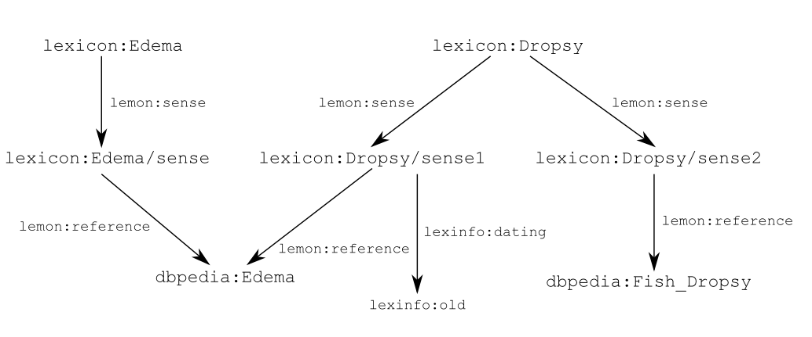
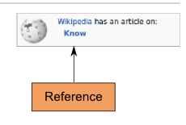
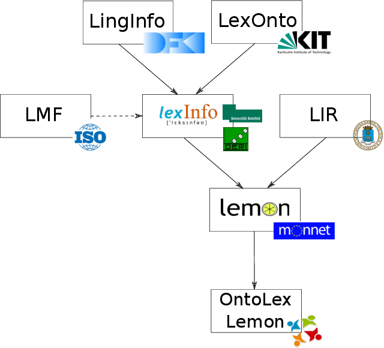
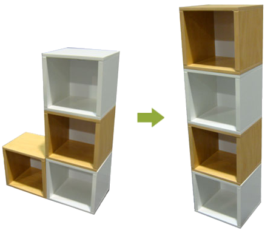
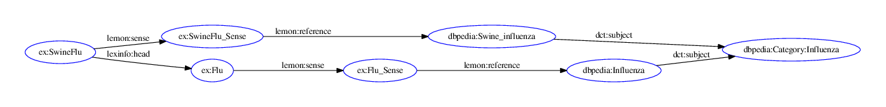
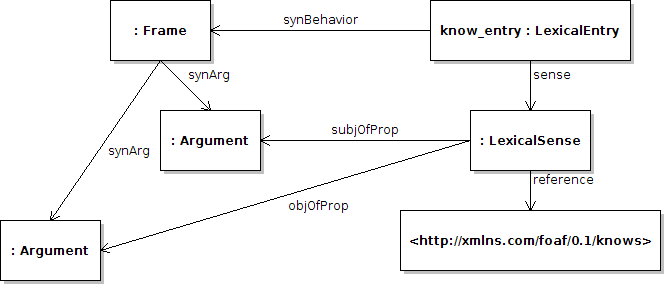
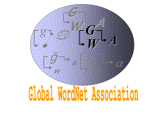
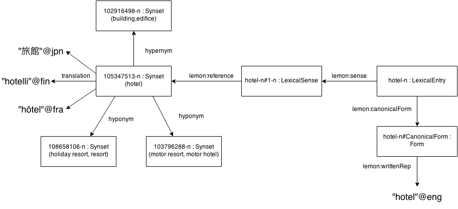

% Ontology-lexica with _lemon_
% John McCrae
% Semantic Computing Group, University of Bielefeld

# Problem

* Ontologies have become popular.
* Use several formalisms: RDFS, OWL, F-Logic, etc.
* Ontologies do not have much linguistic information.

<pre>
:Cat a owl:Class ;
  rdfs:label "cat"@eng ;
  rdfs:label "Katze"@deu .
</pre>

* What is the plural? Easy for English, not for German

# Ontologies

    Take a word:

    
_“edema”_

    And it means something, so we put it in an ontology and give it an
    identifier (URI):

`http://dbpedia.org/resource/Edema`

`http://de.dbpedia.org/resource/\Ödem`

    In fact it (already) has lots of identifiers linked on the web

    

`mesh:D004487`

`icd10:R60.9`

`umls:C0013604`

# Ontologies

*  We can describe the entity with \emph{axioms}
*  Relationships to entities in other ontologies
*  Use reasoning to infer equivalence
*  All done with the “Web Ontology Language” (OWL)
*  Published by W3C in 2002; version 2 in 2008

# Ontology labels

    
Concepts may be identified by many words

_“edema”_

_“edemata”_

_“dropsy”_

*  These are all labels for the same ontology concept
*  No differentiation
*  Cannot say which are plural, which not

  
# Inflection and Synonyms

    We could introduce an element for each word:

# SKOS-XL

*  Similar to SKOS-XL
    *  eXtended Labels for the Simple Knowledge Organization System
    *  W3C Recommendation since 2009
*  SKOS-XL does not allow multiple forms of the same label
    *  No grouping of “edema” and “edemata”
*  “We [TopQuadrant] have yet to hear a use case that cannot be supported
    by SKOS alone” (<a href="http://topquadrantblog.blogspot.de/2012/07/who-needs-skos-xl-maybe-no-one.html" class="cite">Who need SKOS-XL? Maybe no-one. (Polikoff, 2013)</a>)

# Forms

But such a distinction is only useful if we can say why:

_“edema”_ (**singular**)

_“edemata”_ (**plural**)

Hence, forms are also nodes:

# Senses

Sometimes we wish to say something about why a particular word is used

_“edema”_ (**modern**)

_“dropsy”_ (**antiquated**)

Hence we introduce a sense to describe the usage of a word with a given meaning

# The core of _lemon_

# So..., what is a (ontology-)lexicon?
*  A lexicon is a collection of lexical information
*  We do not need to define semantics within the lexicon
*  “An ontology-based semantic lexicon would leave the semantics to the
      ontology, focusing instead on providing domain-specific terms and object
      descriptions in the ontology.” (Buitelaar, 2010)
    
# Dictionaries as lexica
*  In fact, a lexicon represents much of the information already found in a dictionary
*  That is words, their forms and their meaning
*  Must be machine-readable
*  Take Wiktionary as an example
      
# Wiktionary as a lexicon

# Wiktionary as a lexicon

      
# Wiktionary as a lexicon

# Wiktionary as a lexicon

# _lemon_'s origins

*  Lexical Markup Framework (ISO 24613)
    *  Standard for representing lexicons
    *  XML
*  LexInfo, LIR
    *  Represent lexical information relative to an ontology
    *  OWL
*  SKOS (W3C Standard)
    *  Designed for Taxonomy/Vocabulary representation
    *  RDF

      

# Design goals
*  RDF(S)
*  Conciseness
*  Not prescriptive 
    *  i.e., uses data categories
*  Semantics by reference 
    *  i.e., uses ontologies
*  Extensible
      
# Why _lemon_: RDF(S)

*  RDF models are labelled directed graphs
    *  Allows for smarter representation
*  Each entry has a URI
    *  Queriable on the web using standards
    *  Clear responsibility for data 
*  Linking possible between different lexica
    *  Reuse of lexicon data
*  Some induction possible (subproperties, classes etc.)

	
# Why _lemon_: Conciseness

*  Small models (i.e., fewer links, fewer kB) 
*  Easier to understand
*  "Open-world": Not necessary to state all facts
    *  Multiple points of view

# Why _lemon_: Semantics by Reference

*  Meaning of a word given by reference
*  Reference (generally an ontology) capable of representing more complex semantic information
*  Disambiguation is performed relative to the ontology
*  No (traditional) word senses
    *  No clashing of word senses in cross-lingual mappings

# Why _lemon_: Modular and extensible
	

*  RDF(S) extensibility allows representation of
    *  Subtle differences
    *  Unexpected data categories
*  Modularity
    *  Different modules for different user requirements
    *  New modules can be added later without affecting core

# Modules

# Grammatical Description

We can annotate a lexical entry by adding propeties, e.g.,

<pre>
ex:Katze lexinfo:partOfSpeech lexinfo:noun ;
  lexinfo:gender lexinfo:feminine .

lexinfo:feminine dcr:datcat
  <http://isocat.org/datcat/DC-247> .

lexinfo:noun dcr:datcat
  <http://isocat.org/datcat/DC-1333> .
</pre>

# Grammatical Decomposition

<pre>
ex:SwineFlu lemon:sense ex:SwineFlu_Sense ;
  lexinfo:head ex:Flu .
ex:Flu lemon:sense ex:Flu_Sense .
ex:SwineFlu_Sense lemon:reference dbpedia:Swine_influenza .
ex:Flu_Sense lemon:reference dbpedia:Influenza .

dbpedia:Influenza dct:subject category:Influenza .
dbpedia:Swine_influenza dct:subject category:Influenza .
</pre>

<!--%\frame{
%# Decomposition}
%	\begin{itemize}
%	*  Entries marked as \textit{Word},\textit{Phrase} or \textit{Part} (of word)
%	*  Decomposed into sub-entries 
%	\begin{itemize}
%		*  Phrase $\rightarrow$ Words
%		*  Word $\rightarrow$ Words and/or Parts
%	\end{itemize}
%	*  Implemented by RDF list
%	\begin{itemize}
%	*  Ordered
%	\end{itemize}
%	*  Components may be marked to show necessary form properties
%	\end{itemize}
%}
%
%\frame{
%	# Decomposition: example}
%	\begin{center}
%	\vspace{7mm}
%	\includegraphics[width=8cm]{img/description-ex3.png}
%	\end{center}
%}
%
%\frame{
%	# Properties}
%	\imageboxwider{
%	\begin{itemize}
%	*  Any element in the lexicon may have properties
%	*  All propeties are stated as subproperties of _lemon_'s \texttt{property}
%	*  _lemon_ does not have any such properties or values. A separate ontology is required
%	\begin{itemize}
%	*  e.g., ISOcat, GOLD, LexInfo
%	\end{itemize}
%	\end{itemize}
%	}{img/ISOcat_logo.png}
%}
%
%\begin{frame}[fragile]{Properties: example}
%\vspace{0.5cm}
%\begin{verbatim}
%@prefix isocat: <http://www.isocat.org/datcat/> .
%
%:katt a lemon:Word ;
%  lemon:canonicalForm [ 
%    lemon:writtenRep "katt"@swe ;
%    isocat:DC-251 isocat:DC-252 ] ; # number=singular
%  
%  lemon:otherForm [
%    lemon:writtenRep "katter"@swe ;
%    isocat:DC-251 isocat:DC-253 ] . # number=plural
%
%isocat:DC-251 rdfs:subPropertyOf lemon:property .
%\end{verbatim}
%\end{frame}
%
%\frame{
%# Variation}
%	\begin{itemize}
%	*  Forms, Entries and Senses may be marked as variants
%	*  Again, few _lemon_ properties, mostly use external ontology
%	*  Mark links as subproperties of \texttt{formVariant},\texttt{lexicalVariant}, \texttt{senseRelation}
%	*  Sense Relation does have subproperties \texttt{equivalent}, \texttt{broader}, \texttt{narrower},
%	\texttt{incompatible}
%	*  Sense Relation can be used to model \texttt{translationOf}
%	\end{itemize}
%}
%
%\frame{
%# Variation: example}
%	\begin{center}
%	\vspace{7mm}
%	\includegraphics[width=8cm]{img/variation-ex2.png}
%	\end{center}
%}-->
	
# Frames and Correspondence

*  The verb “know” is always used in a sentence
    *  “John knows Sebastian”
*  Similarly `foaf:knows` is only used in a triple
    *  `<http://john.mccr.ae/> foaf:knows <http://aksw.org/SebastianHellmann>`
*  It is necessary to state how these corresponds
        
# Frames and Correspondence

*  Linguistically we define each word as having a _subcategorization frame_
    *  e.g., “X knows Y”
*  Each RDF property has two arguments
    *  _Subject_
    *  _Object_
*  We need to state the correspondence of syntactic arguments and semantic arguments

       

# OntoLex Community Group

*  W3C setup community groups as “an open forum, without fees, where Web developers and other stakeholders develop specifications”
*  OntoLex group was set up with the following goals
    1. Develop model for representation of lexica relative to ontologies
    2. Demonstrate value of representing lexica on the Semantic Web
    3. Best practices for data categories
    4. Show improvement in NLP by means of ontology-lexica
    5. Bring together people working on standards for linguistic information
    6. Build interoperability between existing models
*  Chaired by Philipp Cimiano (Uni Bielefeld) and Paul Buitelaar (DERI,
    Galway)
*  78 Participants across \textgreater 50 institutes

# OntoLex Lemon
*  New model using W3C namespace, but (mostly) backwards-compatible
*  Introduce new `Concept` class to describe non-ontological semantics (e.g., “synsets”)
*  Modules:
    *  Syntax and Semantics
    *  Decomposition
    *  Variation and Translation
    *  Metadata

# Resources using lemon
*  lemonUby (Darmstadt)
    *  Existing resources, standardized to LMF, and interlinked
    *  WordNet, FrameNet, VerbNet, OmegaWiki, Wiktionary
    *  English, German
*  wiktionary.dbepdia.org (Leipzig)
    *  Conversion of Wiktionary to _lemon_
    *  Many languages
*  PAROLE/SIMPLE Lexicon (Pompeu Fabra, Barcelona)
    *  English, Spanish, Catalan
*  DBNary (Grenoble)
    *  Conversion of Wiktionary to LMF and _lemon_
    *  French, English and German.

# Applications of lemon

*  Ontology-based information extraction
*  Ontology localization
*  Natural language generation 
*  Integration into NLP pipelines 
*  Question answering 

# Summary

* _lemon_ is a proposed model for the ontology-lexicon interface
* Soon to be a W3C Vocabulary under the OntoLex CG
* Concise, modular, extensible RDF(S) model
* Yet, still linguistically sophisticated
* Already in use

# &nbsp;

WordNet-RDF

# What is WordNet?

* WordNet is one of the oldest and most widely used lexico-semantic resources
* Has been used for
    * Word sense disambiguation
    * Query expansion
    * Entity recognition
    * Event processing
    * Sentiment analysis
    * etc., etc.,

# WordNet as a global project

* WordNets have been developed for over 70 languages
* Has been extended by
    * FrameNet
    * VerbNet
    * OntoNotes
    * etc., etc.,
* It is difficult to link back to the original
* More so as WordNet synsets are not stable cross-version!
    * Actually, it is not clear which synsets map

# WordNet-RDF

* WordNet needs RDF
* To be a stable center of the LLOD cloud
* To enable easy interversion linking
* To integrate with the Semantic Web community

# Wait, hasn't this been done already?

* Yes:
    * W3C WordNet
    * VU Wordnet 3.0 
    * As part of UBY, BabelNet, etc.
* But:
    * Not involved with development of WordNet
    * Not hosted by data producer (Princeton)
    * Not updated with new releases

# _lemon_ and WordNet

* _lemon_ as the W3C Model for lexica should be a natural choice
* WordNet strongly influenced the development of the Lexical Markup Framework (LMF)
* LMF strongly influenced _lemon_
* Thus, _lemon_ fits closely to WordNet

# WordNet as an ontology

* But... _lemon_ requires reference to an ontology
* We treat the WordNet synset graph as the ontology
* We do not assign the synsets OWL types
    * Instead they are `skos:Concept`s

# WordNet stable identifiers

Synsets:

<pre>
http://wordnet-rdf.princeton.edu/wn31/103547513-n
</pre>

* Version: `wn31`
* Part-of-speech: `1********-n`
* Offset identifier: `03547513`

Words:

<pre>
http://wordnet-rdf.princeton.edu/wn31/hotel-n
</pre>

* Version: `wn31`
* Lemma: `hotel`
* Part-of-speech: `n`

# Wordnet data example

# External data linking

* Open Multilingual Wordnet 
* lemonUBY
* VerbNet
* W3C WordNet

# Including translations

* There are three ways of including translations in _lemon_

# Including translations

* By Reference
    * Ontology-based semantics
* By Sense Relationship
    * Allows exact correspondence, e.g., "NATO"@en => "OTAN"@fr, "North Atlantic Treaty Organization"@en => "Organisation du traité de l'Atlantique Nord"@fr
    * Explicit links
* As datatype property
    * No further annotation
    * Easy to query

# Links to other resources

* lemonUBY
    * To WordNet 3.0 data on lexical entries and synsets
* VerbNet
    * To frames on a sense level
* W3C WordNet
    * Links on a lexical entries and synsets
* Your data?

# Linking to previous version

* URI schemes are also supported for previous version
    * Implemented by 303 redirect

e.g.,

<tt>http://wordnet-rdf.princeton.edu/wn30/03542333-n</tt>

⇓

<tt>http://wordnet-rdf.princeton.edu/wn31/103547513-n</tt>

# Summary

* First Princeton WordNet version
* Provides stable identifiers
    * i.e., will support the interlingual index
* Linked already to many resources
* Includes extra data (e.g., translations) from other open licensed resources
